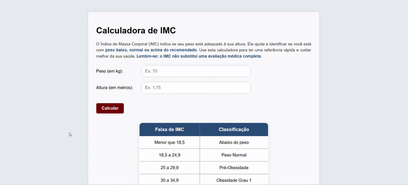

# Calculadora-de-IMC


Este é um **site de Calculadora de IMC (Índice de Massa Corporal)** desenvolvido com **HTML, CSS e JavaScript**, que permite calcular rapidamente o IMC e visualizar em qual faixa de peso o usuário se encontra.

---

## 🌟 Funcionalidades

- Entrada de **peso** (kg) e **altura** (m).  
- Validação de dados (não permite valores negativos ou inválidos).  
- Cálculo automático do IMC com clique no botão **"Calcular"**.  
- Destaque da **linha correta da tabela** de acordo com o IMC do usuário.  
- Mensagem explicativa sobre o IMC, incluindo aviso:  
  **"O IMC não substitui uma avaliação médica completa."**  
- Interface moderna, responsiva e com efeitos visuais.

---

## 📊 Faixas de IMC

| Faixa de IMC   | Classificação       |
|----------------|------------------|
| Menor que 18,5 | Abaixo do peso     |
| 18,5 a 24,9    | Peso Normal        |
| 25 a 29,9      | Pré-Obesidade      |
| 30 a 34,9      | Obesidade Grau 1   |
| 35 a 39,9      | Obesidade Grau 2   |
| 40 ou mais     | Obesidade Grau 3   |

---

## 🎬 Demonstração Visual

Aqui você pode ver como a tabela se destaca conforme o IMC calculado:



> O GIF mostra o usuário inserindo peso e altura e a linha correspondente sendo destacada na tabela.

---

## 💻 Tecnologias Utilizadas

- **HTML5** – Estrutura do site.  
- **CSS3** – Estilização moderna e efeitos de destaque.  
- **JavaScript** – Validação de dados, cálculo do IMC e destaque da linha correta.

---

## 🚀 Como Usar

1. Clone ou baixe o repositório:
   ```bash
   git clone https://github.com/SEU-USUARIO/calculadora-imc.git
Abra o arquivo index.html no navegador.

Insira seu peso (kg) e altura (m).

Clique em "Calcular" e veja a linha correta da tabela destacada.